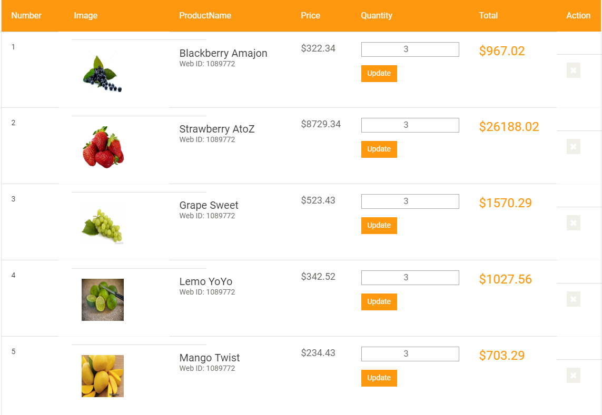

## PHP OOP eCommerce Site

This is an eCommerce site built by PHP in OOP way. Though it is not fully completed ,most of the features are appeared here.You can download full source code.

### Some Features: 
 
 1. Using ALERTIFY JS for flash messages.
 2. Using Categories & Brands
 3. Quantity maintained from cart page easily.
 4. CRUD in Admin Panel & etc.

 

 

 

 

 

Visit my website: [www.rh-rumman.me](http://www.rh-rumman.me)

**Admin Panel Link => default-path/myadmin**

#### That's All.Thanks.